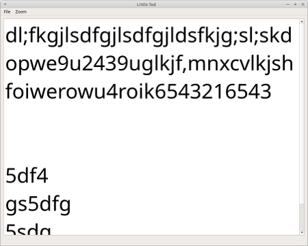

# Little Text Editor

Did You ever have situation that someone was pressing all keys on the keyboard in random manner? 
Did he accidently opened command line and executed ```format c:``` or ```sudo rm -rf /```?

With this app You can let Your *inner* child to press keys like a crazy without fear of damaging Your operating system.


## Disabled keys

- context menu
- Alt + F4
- Alt key -- switching to application menu
- multimedia keys (Linux only)
- Print Screen key (Linux only)
- every Alt + ... combination (Linux only)
- power/sleep button (Xfce only)


## Screens

[](doc/app-screen-big.png)

